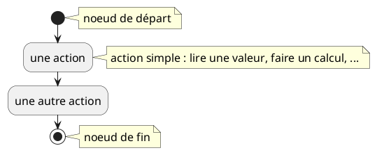
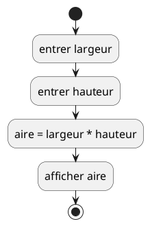
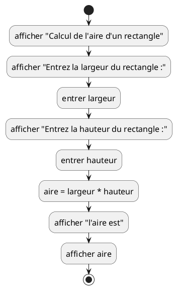
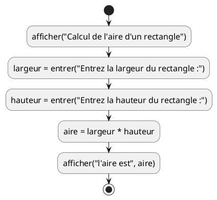

# Qu'est-ce qu'un algorithme ?

## Algorithmes : Définitions

Commençons par quelques définitions du mot *algorithme* :

- [Cambridge Dictionary](https://dictionary.cambridge.org/dictionary/english/algorithm)
    - une liste d'instructions pour résoudre un problème
    - un ensemble d'instructions ou de règles mathématiques qui, habituellement
      données à un ordinateur, aideront à calculer une réponse à un
      problème
- [Merriam-Webster](https://www.merriam-webster.com/dictionary/algorithm)
    - une procédure pour résoudre un problème mathématique (comme celui de
      trouver le plus grand diviseur commun) en un nombre fini d'étapes qui
      implique souvent la répétition d'une opération
    - *plus généralement* : une procédure étape par étape pour résoudre un
      problème ou accomplir une certaine fin
- [Geeks for Geeks](https://www.geeksforgeeks.org/introduction-to-algorithms/)
    - Un ensemble fini de règles ou d'instructions à suivre dans les calculs
      ou d'autres opérations pour résoudre des problèmes
    - Une procédure pour résoudre un problème mathématique en un nombre fini
      d'étapes qui implique souvent des opérations récursives
- Autres définitions possibles :
    1. Un algorithme est une procédure bien définie qui permet à un ordinateur
       de résoudre un problème. Une autre façon de décrire un algorithme est de
       dire qu'il s'agit d'une approche étape par étape pour résoudre un
       problème ou accomplir une tâche.
    2. En informatique et en mathématiques, un algorithme est une séquence
       d'instructions dont le principal objectif est de résoudre un problème
       spécifique, d'effectuer une certaine action ou de calculer. Dans certains
       cas, les algorithmes sont utilisés pour le traitement des données et les
       tâches de raisonnement automatisé.
    3. Un algorithme est un ensemble spécifique d'instructions conçues pour
       effectuer une tâche particulière. Cela peut être un processus simple,
       comme la multiplication de deux nombres, ou une opération complexe, comme
       la lecture d'un fichier vidéo compressé. Les moteurs de recherche
       utilisent des algorithmes complexes pour trier les pages Web pertinentes
       parmi des millions de résultats.
    4. Un algorithme en informatique est une procédure bien définie qui prend
       certaines valeurs en entrée et les traite pour produire une certaine
       valeur en sortie. Les algorithmes sont essentiels pour l'exécution de
       procédures étape par étape pour les calculs et le traitement des données.
    5. Un algorithme est une séquence de comportement étape par étape qui
       définit un ensemble de calculs. Ils sont utilisés pour le calcul, le
       traitement des données, le raisonnement automatisé et d'autres tâches.

Veuillez noter qu'un algorithme doit être clair et sans ambiguïté, il doit avoir
des entrées et des sorties bien définies, et il doit être fini.

Lors de la conception d'un algorithme, il y aura généralement des entrées
données à l'algorithme. Ensuite, après avoir effectué des calculs en utilisant
ces entrées, les résultats seront émis ou renvoyés à un utilisateur, ou à un
autre algorithme qui utilisera ces résultats pour effectuer ses propres calculs
à être sortis ou renvoyés. En d'autres termes, les algorithmes pourraient être
chaînés les uns à la suite des autres.

## Notation sous forme de diagrammes

Pour représenter les algorithmes graphiquement, nous allons utiliser *diagrammes
d'états UML*, en utilisant la notation disponible dans le
logiciel [PlantUML](https://plantuml.com/state-diagram).

Pour représenter les algorithmes de manière graphique, nous utiliserons les
**Diagrammes d'Activité**, et nous utiliserons
[PlantUML](https://plantuml.com/state-diagram)
pour les dessiner. Nous représenterons également les algorithmes en pseudocode,
dans une notation similaire à celle du langage de programmation Python. Plus
tard, après avoir discuté des types de données et de certains autres sujets,
nous écrirons directement les algorithmes dans le langage de programmation
Python. Le diagramme suivant montre la notation pour les diagrammes d'activité
les plus basiques.




??? note "Code PlantUML"

    ```plantuml
    @startuml
    skinparam defaultFontSize 16
    start
    note right 
        noeud de départ
    end note
    :une action;
    note right
       action simple : lire une valeur, faire un calcul, ...
    end note
    :une autre action;
    stop
    note right
        noeud de fin
    end note
    @enduml
    ```


## Exemples

### Calcul de l'aire d'un rectangle

Commençons par un exemple simple : comment calculons-nous l'aire d'un
rectangle ? Nous avons besoin de 2 valeurs pour calculer l'aire d'un rectangle :
sa `largeur` et sa `hauteur`. Nous supposons pour l'instant que ces 2 valeurs
seront entrées dans le programme par un utilisateur, à l'aide d'un dispositif
d'entrée (probablement un clavier), et que les résultats seront affichés à
l'utilisateur à l'aide d'un dispositif de sortie (probablement un écran). Nous
verrons plus tard que les entrées et les sorties peuvent ne pas être prises ou
données directement par/aux utilisateurs, mais pourraient plutôt être données à
une fonction en tant que paramètres, ou renvoyées par une fonction.

- *Entrées* : la `largeur` et la `hauteur` du rectangle
- *Sortie* : l'`aire` du rectangle

#### Diagramme



??? note "Code PlantUML" 

    ```plantuml
    @startuml
    skinparam defaultFontSize 16
    start
    :entrer largeur;
    :entrer hauteur;
    :aire = largeur * hauteur;
    :afficher aire;
    stop
    @enduml
    ```


#### Pseudocode

```pseudocode

largeur = entrer()
hauteur = entrer()
aire = largeur * hauteur
afficher(aire)
```

#### Discussion

Certaines actions concernent le calcul de certaines valeurs basées sur d'autres
valeurs, comme `aire = largeur * hauteur`. Notez que nous utilisons `*` comme
symbole de multiplication. Dans ce cas, le calcul `largeur * hauteur` est écrit
à droite du signe égal (`=`), et le résultat est conservé dans `aire`, qui sera
affiché dans l'étape suivante.

Dans cet exemple, il y a **3 variables** : `largeur`, `hauteur` et `aire`. Ces
variables sont utilisées pour représenter ou retenir certaines valeurs qui
seront entrées ou calculées, et qui seront réutilisées plus tard dans les
calculs ou envoyées en sortie.

Les diagrammes d'activité sont *de haut niveau*, ce qui signifie qu'ils sont
souvent un peu simplifiés, ils n'entrent pas dans chaque petit détail. Nous ne
nous embêtons pas à définir chaque variable formellement, donc lorsque nous
écrivons `entrer largeur`, il est sous-entendu qu'une variable nommée `largeur`
sera définie, et sa valeur sera ce qui a été entré. De même, pour `afficher aire`,
nous disons simplement que nous voulons que `aire` soit affichée en sortie,
mais nous ne
nous embêtons pas avec les détails d'où et comment `aire` sera affichée. Nous
serons un peu plus précis dans le pseudocode, et beaucoup plus précis lorsque
nous écrirons un programme pour faire les calculs pour de vrai. À ce stade, les
diagrammes sont utilisés pour avoir une idée de ce qui doit être fait. Ils
deviendront plus compliqués quand nous rencontrerons des algorithmes plus
complexes. Avec un peu d'expérience, nous serons en mesure d'écrire du code
directement sans créer d'abord des diagrammes d'activité ou écrire du
pseudocode, mais même avec de l'expérience, lorsque nous rencontrons des
problèmes plus complexes, les diagrammes aident souvent. De nombreux types de
diagrammes seront utilisés lors de la conception et du développement de systèmes
logiciels, tels que les diagrammes de *séquences*, de *cas d'utilisation*,
d'*états*, de *classes*...

Les entrées et les sorties sont elles-mêmes des tâches complexes, et dépendront
exactement de la façon dont nous voulons entrer et sortir (afficher) les
valeurs. Nous
résumons donc ces tâches et nous disons simplement pour l'instant que nous
entrons et sortons des valeurs d'une certaine manière. Dans le pseudocode, nous
écrivons ces 2 tâches un peu différemment par rapport aux diagrammes : nous
utilisons la notation de fonction pour être un peu plus précis. La tâche
d'entrer d'une valeur produit (ou donne ou retourne) une valeur, et nous
stockons cette valeur dans une variable, comme dans `largeur = entrer()`. Nous
utilisons les parenthèses`()` pour signifier que nous appelons, ou exécutons, la
fonction `entrer`. La valeur produite est stockée dans la
variable `largeur`. Nous disons aussi que la valeur renvoyée par la
fonction `entrer` est assignée à la variable `largeur`.

Pour pouvoir accomplir sa tâche, la fonction `afficher` a besoin de savoir
quelle
valeur afficher, donc nous lui donnons une valeur entre les `()` lorsque nous
l'appelons. Dans notre exemple, nous lui avons donné la variable `aire`, alors
elle affiche la valeur contenue dans la variable `aire`. `afficher` ne renvoie
aucune valeur, c'est pourquoi nous ne l'assignons à rien.

### Meilleures entrées et sorties

Un problème lors de l'entrée d'une valeur dans l'exemple précédent est que nous
ne donnons aucune information à l'utilisateur sur ce qui doit être entré. Dans
ce cas, l'utilisateur devinera probablement que la largeur et la hauteur doivent
être entrées pour pouvoir calculer l'aire d'un rectangle, mais laquelle doit
être entrée en premier ? Dans ce cas, cela n'a pas vraiment d'importance, car
nous obtiendrons les mêmes résultats, mais en général, l'inversion de 2 entrées
peut changer considérablement les résultats. Nous avons donc besoin de donner
plus d'informations à l'utilisateur.

Voici deux versions faisant la même chose.

#### Diagrammes



??? note "Code PlantUML"

    ```plantuml
    @startuml
    skinparam defaultFontSize 16
    start
    :afficher "Calcul de l'aire d'un rectangle";
    :afficher "Entrez la largeur du rectangle :";
    :entrer largeur;
    :afficher "Entrez la hauteur du rectangle :";
    :entrer hauteur;
    :aire = largeur * hauteur;
    :afficher "l'aire est";
    :afficher aire;
    stop
    @enduml
    ```




??? note "Code PlantUML"

    ```plantuml
    @startuml
    skinparam defaultFontSize 16
    start
    :afficher("Calcul de l'aire d'un rectangle");
    :largeur = entrer("Entrez la largeur du rectangle :");
    :hauteur = entrer("Entrez la hauteur du rectangle :");
    :aire = largeur * hauteur;
    :afficher("l'aire est", aire);
    stop
    @enduml
    ```


#### Discussion

Le premier de ces deux diagrammes est correct, mais il serait généralement
considéré comme trop verbeux. Nous laisserons de côté la sortie supplémentaire
pour nous concentrer sur l'algorithme lui-même, ou nous utiliserons la deuxième
version dans laquelle une nouvelle version de la fonction `entrer` est utilisée
directement dans les diagrammes. Cette version de la fonction `entrer` accepte
une chaîne de caractères en paramètre, qui sera affichée avant d'attendre qu'une
valeur soit entrée. Une chaîne de caractères, pour la distinguer d'une ou de
plusieurs variables, est donnée entre guillemets doubles `""`.

La fonction `afficher` est également utilisée différemment. On lui donne 2 choses
à afficher, une chaîne et une variable contenant les résultats. Elle les
affichera l'une après l'autre.

Nous aurons besoin de messages de sortie plus complets lors de l'écriture du
code, et nous les inclurons souvent lors de l'écriture du pseudocode, mais pas
lors de la création de diagrammes d'activité pour les garder plus petits et nous
aider à nous concentrer sur l'algorithme lui-même, et non sur les détails des
entrées et des sorties, à moins que l'algorithme devait traiter les entrées et
les sorties d'une manière très spécifique.

#### Pseudocode

```pseudocode
afficher("Calcul de l'aire d'un rectangle")
largeur = entrer("Entrez la largeur du rectangle :")
hauteur = entrer("Entrez la hauteur du rectangle :")
aire = largeur * hauteur
afficher("l'aire est", aire)
```