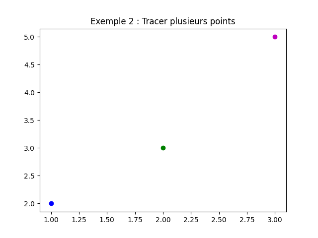
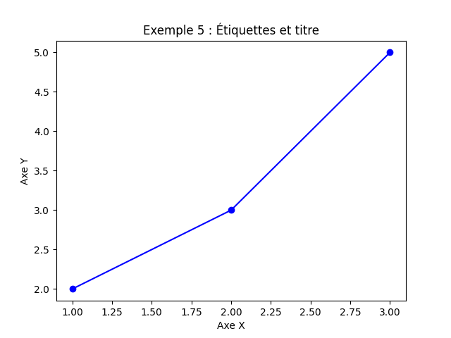
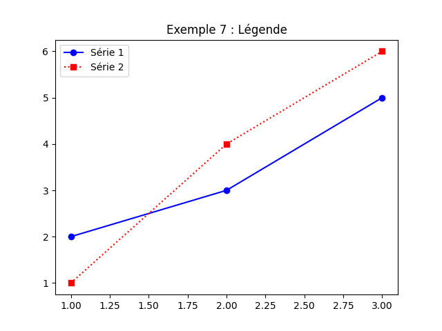
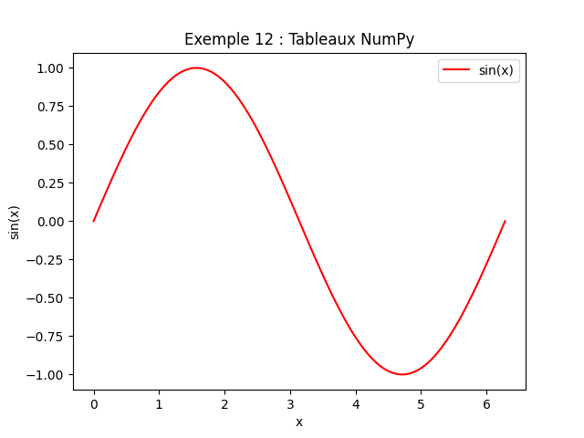
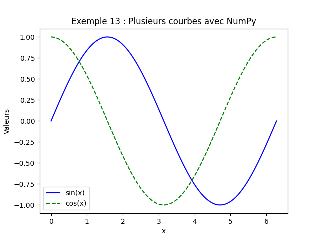
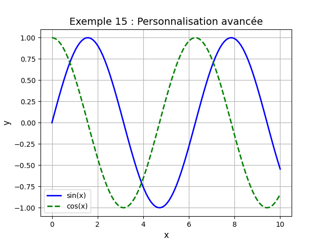

# 2. **Introduction à `matplotlib.pyplot`**

`matplotlib.pyplot` est un module de `matplotlib` qui fournit une interface simple pour créer des **graphiques 2D**. Il
est particulièrement utile pour visualiser des données de manière claire et esthétique.

---

## **1. Installation et importation**

Assurez-vous d'avoir installé `matplotlib` :

```bash
pip install matplotlib
```

Importez le module `pyplot` (généralement abrégé en `plt`) :

```python
import matplotlib.pyplot as plt
```

---

## **2. Diagrammes simples avec des points fixes**

### **2.1 Tracer un point**

```python
plt.plot(2, 3, 'ro')  # 'ro' : point rouge (red circle)
plt.show()
```

- **`plot(x, y, format)`** : Trace un point aux coordonnées `(x, y)`.
- **`format`** : Chaîne de caractères définissant la couleur et le symbole (ex. : `'ro'` pour un cercle rouge).


---

### **2.2 Tracer plusieurs points**

```python
plt.plot(1, 2, 'bo')  # Point bleu
plt.plot(2, 3, 'go')  # Point vert
plt.plot(3, 5, 'mo')  # Point magenta
plt.show()
```


---

### **2.3 Tracer une ligne entre des points**

```python
plt.plot([1, 2, 3], [2, 3, 5], 'b-')  # Ligne bleue reliant les points
plt.show()
```

- **`'b-'`** : Ligne bleue (`b` pour *blue*, `-` pour une ligne continue).


---

## **3. Personnalisation des points et des lignes**

### **3.1 Couleurs et symboles**

Voici quelques options pour les **couleurs** et les **symboles** :

| **Couleur**     | **Symbole**    | **Style de ligne**          |
|-----------------|----------------|-----------------------------|
| `'b'` (bleu)    | `'.'` (point)  | `'-'` (ligne continue)      |
| `'g'` (vert)    | `'o'` (cercle) | `'--'` (ligne tirets)       |
| `'r'` (rouge)   | `'s'` (carré)  | `':'` (ligne en pointillés) |
| `'c'` (cyan)    | `'*'` (étoile) | `'-.'` (ligne point-tiret)  |
| `'m'` (magenta) | `'x'` (croix)  |                             |

**Exemple** :

```python
plt.plot([1, 2, 3], [2, 3, 5], 'g--')  # Ligne tiret verte
plt.plot([1, 2, 3], [1, 4, 6], 'rs:')  # Carrés rouges reliés par une ligne en pointillés
plt.show()
```


---

### **3.2 Ajouter des étiquettes et un titre**

```python
plt.plot([1, 2, 3], [2, 3, 5], 'bo-')  # Ligne bleue avec des cercles
plt.xlabel("Axe X")  # Étiquette de l'axe X
plt.ylabel("Axe Y")  # Étiquette de l'axe Y
plt.title("Exemple 5 : Étiquettes et titre")  # Titre du graphique
plt.show()
```


---

### **3.3 Modifier les limites des axes**

```python
plt.plot([1, 2, 3], [2, 3, 5], 'go--')
plt.xlim(0, 4)  # Limites de l'axe X : de 0 à 4
plt.ylim(0, 6)  # Limites de l'axe Y : de 0 à 6
plt.show()
```


---

### **3.4 Ajouter une légende**

```python
plt.plot([1, 2, 3], [2, 3, 5], 'bo-', label="Série 1")  # Ajout d'une légende
plt.plot([1, 2, 3], [1, 4, 6], 'rs:', label="Série 2")
plt.legend()  # Affiche la légende
plt.show()
```


---

## **4. Diagrammes avec des listes de valeurs**

### **4.1 Tracer une courbe à partir de listes**

```python
x = [0, 1, 2, 3, 4, 5]
y = [0, 1, 4, 9, 16, 25]  # y = x²

plt.plot(x, y, 'm-', label="y = x²")
plt.xlabel("x")
plt.ylabel("y")
plt.title("Fonction quadratique")
plt.legend()
plt.show()
```


---

### **4.2 Tracer plusieurs courbes**

```python
x = [0, 1, 2, 3, 4, 5]
y1 = [0, 1, 4, 9, 16, 25]  # y = x²
y2 = [0, 1, 2, 3, 4, 5]  # y = x

plt.plot(x, y1, 'b-', label="y = x²")
plt.plot(x, y2, 'g--', label="y = x")
plt.xlabel("x")
plt.ylabel("y")
plt.title("Comparaison de fonctions")
plt.legend()
plt.show()
```


---

### **4.3 Diagramme en barres**

```python
categories = ["A", "B", "C", "D"]
valeurs = [5, 7, 3, 8]

plt.bar(categories, valeurs, color='cyan')  # Diagramme en barres
plt.xlabel("Catégories")
plt.ylabel("Valeurs")
plt.title("Diagramme en barres")
plt.show()
```


---

### **4.4 Diagramme en secteurs (camembert)**

```python
categories = ["A", "B", "C", "D"]
valeurs = [15, 30, 45, 10]

plt.pie(valeurs, labels=categories, autopct='%1.1f%%')  # Diagramme en secteurs
plt.title("Répartition des valeurs")
plt.show()
```


---

## **5. Diagrammes avec des tableaux de données**

### **5.1 Utiliser des tableaux NumPy**

```python
import numpy as np

x = np.linspace(0, 2 * np.pi, 100)  # 100 valeurs entre 0 et 2π
y = np.sin(x)  # y = sin(x)

plt.plot(x, y, 'r-', label="sin(x)")
plt.xlabel("x")
plt.ylabel("sin(x)")
plt.title("Fonction sinus")
plt.legend()
plt.show()
```


---

### **5.2 Tracer plusieurs courbes avec des tableaux**

```python
x = np.linspace(0, 2 * np.pi, 100)
y1 = np.sin(x)
y2 = np.cos(x)

plt.plot(x, y1, 'b-', label="sin(x)")
plt.plot(x, y2, 'g--', label="cos(x)")
plt.xlabel("x")
plt.ylabel("Valeurs")
plt.title("Fonctions sinus et cosinus")
plt.legend()
plt.show()
```


---

### **5.3 Diagramme de dispersion (scatter plot)**

```python
x = np.random.rand(50)  # 50 valeurs aléatoires entre 0 et 1
y = np.random.rand(50)

plt.scatter(x, y, color='blue', marker='o')  # Diagramme de dispersion
plt.xlabel("X")
plt.ylabel("Y")
plt.title("Nuage de points aléatoires")
plt.show()
```


---

### **5.4 Personnalisation avancée**

```python
x = np.linspace(0, 10, 100)
y1 = np.sin(x)
y2 = np.cos(x)

plt.plot(x, y1, 'b-', linewidth=2, label="sin(x)")  # Épaisseur de la ligne
plt.plot(x, y2, 'g--', linewidth=2, label="cos(x)")
plt.xlabel("x", fontsize=12)  # Taille de la police
plt.ylabel("y", fontsize=12)
plt.title("Fonctions trigonométriques", fontsize=14)
plt.grid(True)  # Ajouter une grille
plt.legend(fontsize=10)
plt.show()
```


---

### **5.5 Sous-graphiques (subplots)**

```python
x = np.linspace(0, 2 * np.pi, 100)
y1 = np.sin(x)
y2 = np.cos(x)

# Créer 2 sous-graphiques côte à côte
fig, (ax1, ax2) = plt.subplots(1, 2, figsize=(10, 4))  # 1 ligne, 2 colonnes

ax1.plot(x, y1, 'b-')
ax1.set_title("sin(x)")
ax1.set_xlabel("x")
ax1.set_ylabel("sin(x)")

ax2.plot(x, y2, 'r--')
ax2.set_title("cos(x)")
ax2.set_xlabel("x")
ax2.set_ylabel("cos(x)")

plt.tight_layout()  # Ajuste l'espacement entre les sous-graphiques
plt.show()
```


---

## Fichier Python contenant tous les exemples

[exemples_pyplot.py](exemples_pyplot.py)


----------

??? info "Utilisation de l'IA"
    Page rédigée en partie avec l'aide d'un assistant IA. L'IA a été utilisée pour générer des 
    explications, des exemples et/ou des suggestions de structure. Toutes les informations ont 
    été vérifiées, éditées et complétées par l'auteur.
