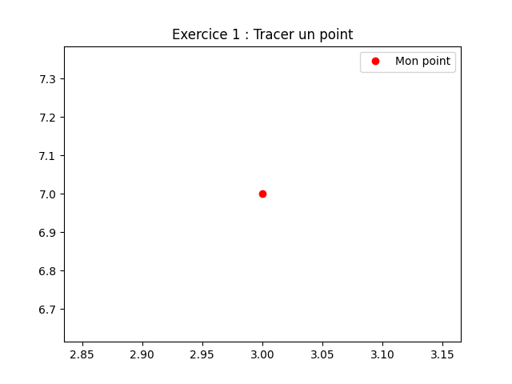
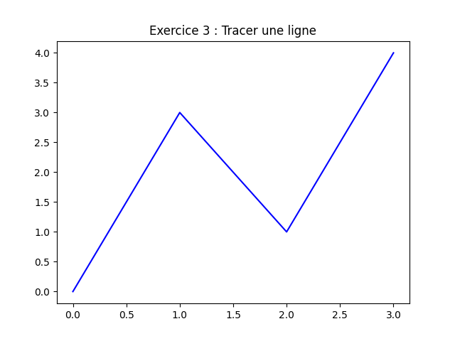
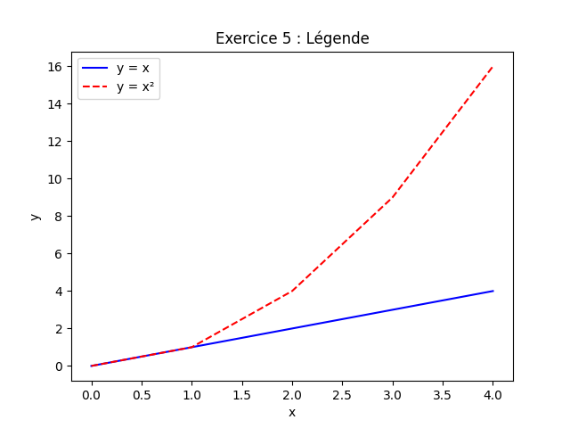
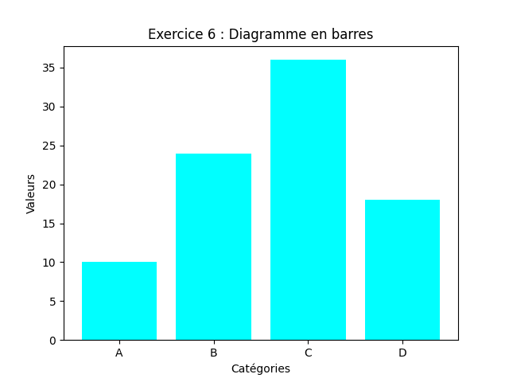
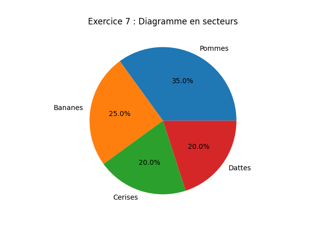
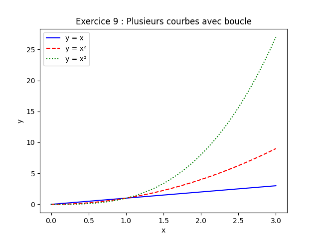
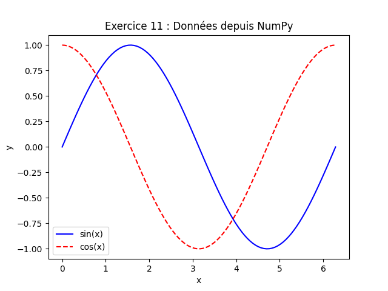
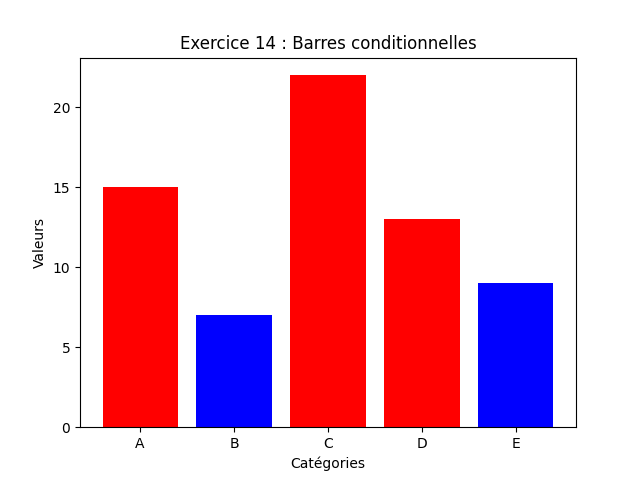
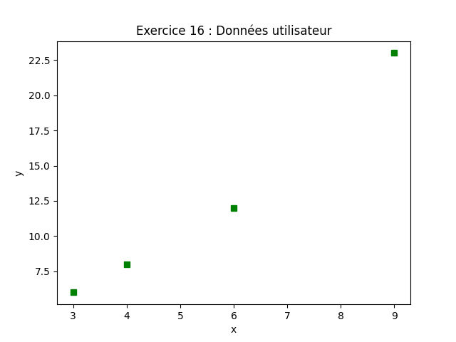
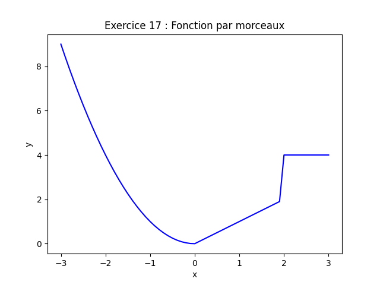

# **Corrigés 2 : Exercices pratiques sur `matplotlib.pyplot`**

---

## **Exercices de base**

### **Exercice 1 : Tracer un point**

```python
import matplotlib.pyplot as plt

plt.plot(3, 7, 'ro', label="Mon point")
plt.legend()
plt.title("Exercice 1 : Tracer un point")
plt.show()
```


---

### **Exercice 2 : Tracer plusieurs points**

```python
plt.plot(1, 2, 'bo', label="Cercle bleu")
plt.plot(3, 5, 'gs', label="Carré vert")
plt.plot(2, 7, 'm^', label="Triangle magenta")
plt.title("Exercice 2 : Trois points")
plt.legend()
plt.show()
```


---

### **Exercice 3 : Tracer une ligne**

```python
plt.plot([0, 1, 2, 3], [0, 3, 1, 4], 'b-')
plt.title("Exercice 3 : Tracer une ligne")
plt.show()
```


---

### **Exercice 4 : Personnalisation des couleurs et symboles**

```python
plt.plot([0, 1, 2], [0, 2, 1], 'r--', label="Ligne pointillée rouge")
plt.plot([0, 1, 2], [1, 3, 0], 'g:', label="Ligne en tirets verts")
plt.xlabel("X")
plt.ylabel("Y")
plt.title("Exercice 4 : Couleurs et symboles")
plt.legend()
plt.show()
```


---

### **Exercice 5 : Ajouter une légende**

```python
x = [0, 1, 2, 3, 4]
y1 = x
y2 = [i ** 2 for i in x]

plt.plot(x, y1, 'b-', label="y = x")
plt.plot(x, y2, 'r--', label="y = x²")
plt.xlabel("x")
plt.ylabel("y")
plt.title("Exercice 5 : Légende")
plt.legend()
plt.show()
```


---

### **Exercice 6 : Diagramme en barres**

```python
categories = ["A", "B", "C", "D"]
valeurs = [10, 24, 36, 18]

plt.bar(categories, valeurs, color='cyan')
plt.xlabel("Catégories")
plt.ylabel("Valeurs")
plt.title("Exercice 6 : Diagramme en barres")
plt.show()
```


---

### **Exercice 7 : Diagramme en secteurs**

```python
categories = ["Pommes", "Bananes", "Cerises", "Dattes"]
valeurs = [35, 25, 20, 20]

plt.pie(valeurs, labels=categories, autopct='%1.1f%%')
plt.title("Exercice 7 : Diagramme en secteurs")
plt.show()
```


---

### **Exercice 8 : Diagramme de dispersion**

```python
import numpy as np

x = np.random.rand(50)
y = np.random.rand(50)

plt.scatter(x, y, color='blue', marker='o')
plt.xlabel("X")
plt.ylabel("Y")
plt.title("Exercice 8 : Nuage de points aléatoires")
plt.show()
```


---

## **Exercices combinés avec boucles, conditionnelles, `ndarray`, et gestion d'erreurs**

### **Exercice 9 : Tracer plusieurs courbes avec une boucle**

```python
x = np.linspace(0, 3, 100)
fonctions = [
    ("y = x", lambda x: x, 'b-'),
    ("y = x²", lambda x: x ** 2, 'r--'),
    ("y = x³", lambda x: x ** 3, 'g:')
]

for label, func, style in fonctions:
    plt.plot(x, func(x), style, label=label)

plt.xlabel("x")
plt.ylabel("y")
plt.title("Exercice 9 : Plusieurs courbes avec boucle")
plt.legend()
plt.show()
```


---

### **Exercice 10 : Tracer une fonction conditionnelle**

```python
x = np.arange(0, 4.1, 0.1)
y = np.where(x < 2, x, 4)

plt.plot(x, y, 'b-')
plt.xlabel("x")
plt.ylabel("y")
plt.title("Exercice 10 : Fonction conditionnelle")
plt.show()
```


---

### **Exercice 11 : Tracer des données depuis un tableau NumPy**

```python
x = np.linspace(0, 2 * np.pi, 100)
y1 = np.sin(x)
y2 = np.cos(x)

plt.plot(x, y1, 'b-', label="sin(x)")
plt.plot(x, y2, 'r--', label="cos(x)")
plt.xlabel("x")
plt.ylabel("y")
plt.title("Exercice 11 : Données depuis NumPy")
plt.legend()
plt.show()
```


---

### **Exercice 12 : Tracer des données avec validation**

```python
def tracer_points_fichier(nom_fichier):
    x, y = [], []

    with open(nom_fichier, 'r') as fichier:
        for ligne in fichier:
            try:
                xi, yi = map(float, ligne.strip().split())
                x.append(xi)
                y.append(yi)
            except ValueError:
                print(f"Ligne invalide ignorée : {ligne.strip()}")

    plt.plot(x, y, 'ro')
    plt.xlabel("x")
    plt.ylabel("y")
    plt.title("Exercice 12 : Données avec validation")
    plt.show()


# Exemple d'utilisation (créer un fichier 'points.txt' avec les données)
tracer_points_fichier("points.txt")
```


---

### **Exercice 13 : Tracer des sous-graphiques avec des boucles**

```python
x = np.linspace(0, 2 * np.pi, 100)
fonctions = [
    ("sin(x)", np.sin),
    ("cos(x)", np.cos),
    ("tan(x)", np.tan),
    ("x²", lambda x: x ** 2)
]

fig, axes = plt.subplots(2, 2, figsize=(10, 8))

for ax, (label, func) in zip(axes.flatten(), fonctions):
    ax.plot(x, func(x))
    ax.set_title(label)
    ax.set_xlabel("x")
    ax.set_ylabel("y")

plt.suptitle("Exercice 13 : Sous-graphiques avec boucle")
plt.tight_layout()
plt.show()
```


---

### **Exercice 14 : Tracer des barres conditionnelles**

```python
categories = ["A", "B", "C", "D", "E"]
valeurs = [15, 7, 22, 13, 9]
couleurs = ['red' if v > 10 else 'blue' for v in valeurs]

plt.bar(categories, valeurs, color=couleurs)
plt.xlabel("Catégories")
plt.ylabel("Valeurs")
plt.title("Exercice 14 : Barres conditionnelles")
plt.show()
```


---

### **Exercice 15 : Tracer des données avec des masques NumPy**

```python
x = np.linspace(0, 4 * np.pi, 100)
y = np.sin(x)
masque_positif = y > 0

plt.plot(x[masque_positif], y[masque_positif], 'ro', label="y > 0")
plt.plot(x[~masque_positif], y[~masque_positif], 'bo', label="y <= 0")
plt.xlabel("x")
plt.ylabel("sin(x)")
plt.title("Exercice 15 : Masques NumPy")
plt.legend()
plt.show()
```


---

### **Exercice 16 : Tracer des données avec gestion d'erreurs**

```python
def tracer_donnees_utilisateur():
    try:
        x_input = input("Entrez les valeurs de x (séparées par des virgules) : ")
        y_input = input("Entrez les valeurs de y (séparées par des virgules) : ")

        x = [float(val) for val in x_input.split(",")]
        y = [float(val) for val in y_input.split(",")]

        if len(x) != len(y):
            raise ValueError("Les listes x et y doivent avoir la même longueur.")

        plt.plot(x, y, 'gs')
        plt.xlabel("x")
        plt.ylabel("y")
        plt.title("Exercice 16 : Données utilisateur")
        plt.show()

    except ValueError as e:
        print(f"Erreur : {e}")


tracer_donnees_utilisateur()
```


---

### **Exercice 17 : Tracer une fonction par morceaux**

```python
x = np.arange(-3, 3.1, 0.1)
y = np.where(x < 0, x ** 2, np.where(x < 2, x, 4))

plt.plot(x, y, 'b-')
plt.xlabel("x")
plt.ylabel("y")
plt.title("Exercice 17 : Fonction par morceaux")
plt.show()
```


---

### **Exercice 18 : Tracer des données depuis un tableau 2D**

```python
donnees = np.array([
    [0, 1, 4, 9],
    [0, 1, 2, 3],
    [0, 1, 8, 27]
])

couleurs = ['b', 'g', 'r']
styles = ['-', '--', ':']

for i, serie in enumerate(donnees):
    plt.plot(serie, color=couleurs[i], linestyle=styles[i], label=f"Série {i + 1}")

plt.xlabel("Index")
plt.ylabel("Valeur")
plt.title("Exercice 18 : Tableau 2D")
plt.legend()
plt.show()
```


---

### **Exercice 19 : Tracer des histogrammes**

```python
donnees = np.random.normal(0, 1, 1000)

plt.hist(donnees, bins=30, color='cyan', edgecolor='black')
plt.xlabel("Valeurs")
plt.ylabel("Fréquence")
plt.title("Exercice 19 : Histogramme")
plt.show()
```


---

### **Exercice 20 : Tracer des données avec boucles et conditions**

```python
x = np.linspace(0, 2 * np.pi, 100)
fonctions = [
    ("sin(x)", np.sin, 'b'),
    ("cos(x)", np.cos, 'r'),
    ("sin(x) + cos(x)", lambda x: np.sin(x) + np.cos(x), 'g')
]

for label, func, couleur in fonctions:
    plt.plot(x, func(x), color=couleur, label=label)

plt.xlabel("x")
plt.ylabel("y")
plt.title("Exercice 20 : Boucles et conditions")
plt.legend()
plt.show()
```


---
**Remarques** :

- Pour les exercices nécessitant des fichiers (ex. : Exercice 12), créez un fichier texte avec les données spécifiées.
- Les exercices combinant `pyplot` avec d'autres notions montrent comment intégrer des boucles, conditionnelles,
  `ndarray`, et gestion d'erreurs pour des visualisations plus dynamiques.

---

